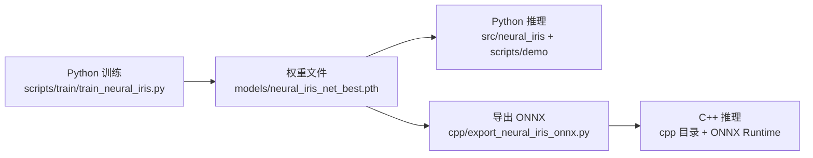

# Neural-IRIS

**面向局部轨迹规划的快速无障碍凸区域生成方法**

Fast Obstacle-Free Convex Region Generation for Local Trajectory Planning

Neural-IRIS 从局部占据地图（128×128）出发，先用卷积神经网络快速预测一个先验椭圆，再通过椭圆的二次型解析构造分离超平面，最终输出可直接作为轨迹规划线性安全约束的无障碍凸区域 $\mathcal{P}=\{x\in\mathbb{R}^2 \mid Ax\le b\}$。相比传统 IRIS 类方法，它避免了在线反复迭代优化椭球，在保持区域质量的同时显著提升生成效率。

> 论文正式发表后，请在此补充 arXiv / DOI 链接（并可附上论文 PDF/Markdown 全文）。

## 使用路径总览：Python 训练 → C++ 部署

**训练、评估、指标复现全部在 Python（PyTorch）中完成；C++（ONNX Runtime）只负责部署阶段的推理加速，不参与训练。** 两者共用同一个训练产物：



- **纯 Python 路径（最小可用）**：安装 Python 依赖 → 准备数据 → 训练 → 推理。整个过程不需要安装 C++ 工具链。
- **C++ 部署路径（可选加速）**：用 Python 训练并导出 ONNX 后，构建 C++ 工程，用于无 Python 环境或要求低延迟的部署场景。

> 注意：C++ 工程只能加载训练好的 ONNX 模型做推理，**不能代替 Python 训练**。导出与构建细节见下文「C++ 推理」一节。

## 目录结构

```text
Neural-IRIS/
├── config/                 # 全局配置（地图、车辆参数、规划器设置）
├── src/
│   ├── dataset/            # 数据生成、过滤、划分、可视化
│   ├── neural_iris/        # 模型、几何处理、推理运行时（核心）
│   └── planner/            # MPC 规划器（hpipm / osqp）、车辆模型、BFS 路径
├── scripts/
│   ├── train/              # 训练、评估、指标绘图
│   └── demo/               # 效果演示（推理可视化、MPC 闭环规划）
├── cpp/                    # C++ ONNX Runtime 推理 + Python bridge（可选）
├── data/                   # 数据集（git 忽略，见“数据准备”）
├── models/                 # 模型权重（git 忽略，需单独下载/训练生成）
├── logs/                   # 训练/评估日志（git 忽略）
└── images/                 # 论文配图（可选，由作者另行发布）
```

所有命令默认在仓库根目录下执行。

## 环境安装

### Python

要求 Python 3.9+，训练需要 CUDA GPU。

```bash
pip install -r requirements.txt
```

其中 `torch` / `torchvision` 会从默认 PyPI 安装 CPU 版本。需要 CUDA 训练时，请按 [PyTorch 官网](https://pytorch.org/get-started/locally/) 给出的命令安装对应 CUDA 版本的 torch，例如：

```bash
pip install torch torchvision --index-url https://download.pytorch.org/whl/cu126
```

可选依赖：

- `onnx`：仅在使用 C++ 后端前导出 ONNX 模型时需要（`cpp/export_neural_iris_onnx.py`）。
- `hpipm_python`：`planner.py` 的 hpipm QP 求解器，不在 PyPI 上，需要从源码构建。若不想安装，把 `config/config.json` 中 `planner_settings.solver` 改为 `"osqp"` 即可（osqp 已包含在 requirements 中）。

### C++（可选）

仅当需要使用 C++ ONNX Runtime 加速推理时才需要：CMake ≥ 3.18、Visual Studio 2022（Windows）、ONNX Runtime 1.19.2（CPU 或 CUDA 版）。详细步骤见 [cpp/README.md](./cpp/README.md)。

## 数据准备

训练和演示需要的数据有两种获取方式（二选一）：直接下载作者处理好的 NPZ 数据集，或者下载原始地图后用预处理脚本自己生成。

### 方式 A：直接下载处理好的数据集（推荐）

作者发布的数据集（`train_iris.npz` / `val_iris.npz` / `test_iris.npz`，与论文实验一致）可从 GitHub Releases 下载：

```bash
python scripts/download_assets.py --dataset
```

解压后得到：

```text
data/iris-dataset/splits/train_iris.npz   # 95,883 样本
data/iris-dataset/splits/val_iris.npz     # 11,985 样本
data/iris-dataset/splits/test_iris.npz    # 11,986 样本
```

### 方式 B：下载原始地图，用预处理脚本自己生成

#### B1. 下载原始地图（Moving AI）

本项目使用 [Moving AI Lab 2D Pathfinding Benchmarks - Street](https://movingai.com/benchmarks/street/index.html) 的地图（Berlin、Boston、London、Paris、Shanghai 等城市）。下载后把 `.map` 文件分别放到：

```text
data/street-map/train/
data/street-map/val/
```

点击数据集页面中的 **Download all maps**，或直接下载 [street-map.zip](https://movingai.com/benchmarks/street/street-map.zip)。训练和演示使用的测试地图是同一基准中不相交的文件。

#### B2. 撒点、裁剪、生成训练标签

```bash
# 撒点：density=0.02，在自由空间随机采样约 2% 的栅格作为锚点
# 裁剪：以每个锚点为中心裁剪 128×128 的局部占据地图
# 生成标签：对每个局部地图运行离线 IRIS 求解器，得到椭圆参数作为监督标签
python src/dataset/generate_dataset.py \
    --map-dir data/street-map \
    --output data/iris-dataset/full_iris_dataset.npz \
    --density 0.02 --patch-size 128 --batch-size 200 --seed 42
```

#### B3. 过滤与划分

```bash
# 过滤：剔除中心锚点不在椭圆内的样本，保证标签几何有效
python src/dataset/filter_dataset.py \
    --input data/iris-dataset/full_iris_dataset.npz \
    --output data/iris-dataset/filtered_iris_dataset.npz

# 按 0.8 / 0.1 / 0.1 划分 train / val / test（固定 seed=42）
python src/dataset/split_dataset.py \
    --input data/iris-dataset/filtered_iris_dataset.npz \
    --out-dir data/iris-dataset/splits
```

两种方式最终都得到同一组文件：

```text
data/iris-dataset/splits/train_iris.npz   # 95,883 样本
data/iris-dataset/splits/val_iris.npz     # 11,985 样本
data/iris-dataset/splits/test_iris.npz    # 11,986 样本
```

## 模型权重

推理必须要有权重文件 `models/neural_iris_net_best.pth`（约 45 MB）。两种获取方式：

1. 从 GitHub Releases 下载（发布后执行 `python scripts/download_assets.py`）；
2. 自行训练生成（见下一节）。

C++ 后端还需要 ONNX 模型 `cpp/models/neural_iris_net.onnx`，可自行导出（`python scripts/download_assets.py --onnx` 或见“C++ 推理”）。

不想训练的话，下载权重后直接跳到「效果展示与推理」运行演示即可。

## 训练

```bash
python scripts/train/train_neural_iris.py
```

说明：

- 硬编码读取 `data/iris-dataset/splits/train_iris.npz`、`val_iris.npz`，最优权重保存到 `models/neural_iris_net_best.pth`；
- 需要 CUDA GPU：训练数据会一次性加载到显存，建议显存 ≥ 8 GB；
- 超参数在脚本内：100 epochs、batch size 512、AdamW lr=3e-4、ReduceLROnPlateau、AMP 混合精度；
- 训练日志与指标曲线输出到 `logs/neural_iris_train/<时间戳>/metrics.csv`。

训练完成后可用以下脚本重绘图：

```bash
# 默认读取 logs/neural_iris_train 下最新一次训练
python scripts/train/plot_training_metrics.py
```

## 评估（复现论文测试指标）

```bash
python scripts/train/final_evaluate_neural_iris.py \
    --model-path models/neural_iris_net_best.pth \
    --data-path data/iris-dataset/splits/test_iris.npz \
    --output-dir logs/neural_iris_eval/final_test
```

可选参数：`--batch-size 512`、`--num-samples N`（快速抽查子集）、`--device cuda`。输出 `test_metrics.json` / `test_metrics.csv` / `test_metrics.png`。

绘制评估结果图：

```bash
python scripts/train/plot_final_test_metrics.py logs/neural_iris_eval/final_test
```

## 效果展示与推理

本节演示训练好的模型如何生成无障碍凸区域。不想自己训练的用户，下载权重（`python scripts/download_assets.py`）和测试数据（方式 A）后即可直接运行。

### 命令行演示

```bash
python scripts/demo/neural_iris_inference.py --backend python --mode headless --num 5
```

- `--backend`：`python`（默认）或 `cpp`（需先构建 C++ bridge）；
- `--mode`：`headless` 保存图片到 `inference_results/<backend>/`，`gui` 弹窗显示；
- `--num`：抽样数量，`-1` 表示全部测试样本。

该脚本需要 `models/neural_iris_net_best.pth` 和 `data/iris-dataset/splits/test_iris.npz`。

### 在代码中调用

```python
import numpy as np
from src.neural_iris import infer_safe_region

# obs_mask: 128×128 uint8，1 表示障碍物
obs_mask = np.zeros((128, 128), dtype=np.uint8)
obs_mask[20:30, 20:40] = 1

polygon, ellipse_P, ellipse_c = infer_safe_region(
    obs_mask, center=(64.0, 64.0), patch_size=128
)
# polygon: 凸区域多边形顶点（N×2）
# ellipse_P, ellipse_c: 预测椭圆的二次型矩阵与中心
```

如需得到半空间约束形式（直接用于 MPC）：

```python
from src.neural_iris import infer_safe_region_halfspaces

A, b, P, c = infer_safe_region_halfspaces(obs_mask)
# 无障碍凸区域: { x | A @ x <= b }
```

## C++ 推理（可选加速）

前置条件：先按上文用 Python 完成训练，得到 `models/neural_iris_net_best.pth`。C++ 环节只负责把训练好的模型导出、加载并做推理，不参与训练。

1. 导出 ONNX：`pip install onnx` 后执行

   ```bash
   python cpp/export_neural_iris_onnx.py
   ```

   输出 `cpp/models/neural_iris_net.onnx`。

2. 下载 ONNX Runtime 1.19.2（[CPU](https://github.com/microsoft/onnxruntime/releases/tag/v1.19.2) / CUDA 版），解压到 `cpp/` 下，目录名保持 `onnxruntime-win-x64-1.19.2`（CPU）或 `onnxruntime-win-x64-gpu-1.19.2`（GPU）。

3. 构建：

   ```powershell
   $ortRoot = (Resolve-Path ".\cpp\onnxruntime-win-x64-1.19.2").Path
   cmake -S cpp -B cpp/build_cpu -G "Visual Studio 17 2022" "-DONNXRUNTIME_ROOT=$ortRoot" -DUSE_CUDA_PROVIDER=OFF
   cmake --build cpp/build_cpu --config Release
   ```

4. 运行独立程序或从 Python 调用：

   ```powershell
   python cpp\dump_sample_mask_txt.py 0
   .\cpp\build_cpu\Release\neural_iris_cpp_infer.exe --onnx cpp\models\neural_iris_net.onnx --mask sample_mask_0.txt --patch 128 --safety 0.5

   $env:NEURAL_IRIS_CPP_BACKEND = "cpu"
   python -c "from cpp.python import infer_safe_region_batch; print(infer_safe_region_batch is not None)"
   ```

完整说明（含 GPU 构建、常见问题）见 [cpp/README.md](./cpp/README.md)。

## MPC 闭环规划实验（可选）

实验脚本位于 `scripts/demo/`，用于验证 Neural-IRIS 生成的凸区域作为 MPC 线性安全约束的效果。该实验在仿真过程中每隔一段时间在车辆前方路径上**在线注入新的静态障碍物**，检验 MPC 能否结合实时占据地图与 Neural-IRIS 半空间约束完成避障：

```bash
python scripts/demo/mpc-neural-iris.py --map random --episodes 5 --no-render --backend python
```

- `--map random` 从 `data/street-map/val/` 随机选择地图，也可传入具体 `.map` 文件名；
- `--no-render` 无界面运行；`--save-video` 保存过程视频；
- `--backend python|cpp` 选择 Neural-IRIS 后端；
- QP 求解器由 `config/config.json` 的 `planner_settings.solver` 决定：默认 `hpipm`（需自行安装 `hpipm_python`），否则改为 `"osqp"`。

## 配置说明（config/config.json）

| 配置项 | 说明 |
| --- | --- |
| `map_settings.map_size` | 地图尺寸（栅格数），如 512 |
| `map_settings.resolution_m_per_cell` | 每个栅格对应的物理长度（米），如 0.25 |
| `map_settings.train_dataset_dir` / `val_dataset_dir` | 训练/验证 `.map` 文件目录 |
| `vehicle_parameters.*` | 车辆几何参数（长、宽、轴距、悬垂、车轮、安全边距，单位米） |
| `planner_settings.solver` | MPC QP 求解器：`hpipm` 或 `osqp` |
| `planner_settings.neural_iris_interface` | Neural-IRIS 后端：`cpp` 或 `python`（C++ 不可用时自动回退 python） |

## 引用

若本工作对你的研究有帮助，请引用：

```bibtex
@misc{neural_iris,
  title  = {Neural-IRIS: 面向局部轨迹规划的快速无障碍凸区域生成方法},
  author = {（作者信息待补充）},
  year   = {2026},
  note   = {论文发表后请在此补充正式引用信息}
}
```

## License

（待补充 —— 仓库公开前请选择一个开源许可证，例如 MIT 或 Apache-2.0。）
