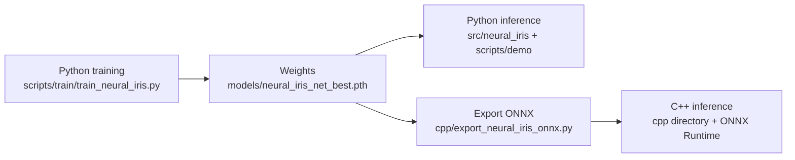

# Neural-IRIS

**English** | [中文](README.zh-CN.md)

Fast Obstacle-Free Convex Region Generation for Local Trajectory Planning

Neural-IRIS takes a 128×128 local occupancy map, predicts a prior ellipse with a convolutional neural network, and then analytically constructs separating hyperplanes from the quadratic form of the ellipse, producing a collision-free convex region
$\mathcal{P}=\{x\in\mathbb{R}^2 \mid Ax\le b\}$
that can be directly used as linear safety constraints in trajectory planning. Compared with classical IRIS-style methods, it avoids the online iterative optimization of the ellipsoid and significantly improves generation efficiency while preserving region quality.

> Add the arXiv / DOI link here once the paper is published (the paper PDF/Markdown can be attached as well).

## Overview: Python Training → C++ Deployment

**Training, evaluation, and metric reproduction are all done in Python (PyTorch); C++ (ONNX Runtime) only accelerates inference at the deployment stage and does NOT participate in training.** Both paths share the same trained artifact:



- **Pure Python path (minimal setup)**: install Python dependencies → prepare data → train → inference. No C++ toolchain is needed.
- **C++ deployment path (optional acceleration)**: after training in Python and exporting ONNX, build the C++ project for deployment scenarios without a Python environment or with strict latency requirements.

> Note: the C++ project can only load the trained ONNX model for inference; it **cannot replace Python training**. See the "C++ Inference" section below for export and build details.

## Repository Structure

```text
Neural-IRIS/
├── config/                 # Global configuration (maps, vehicle parameters, planner settings)
├── src/
│   ├── dataset/            # Dataset generation, filtering, splitting, visualization
│   ├── neural_iris/        # Model, geometry processing, inference runtime (core)
│   └── planner/            # MPC planner (hpipm / osqp), vehicle model, BFS path
├── scripts/
│   ├── train/              # Training, evaluation, metric plotting
│   └── demo/               # Demos (inference visualization, MPC closed-loop planning)
├── cpp/                    # C++ ONNX Runtime inference + Python bridge (optional)
├── data/                   # Datasets (git-ignored; see "Data Preparation")
├── models/                 # Model weights (git-ignored; download or train)
├── logs/                   # Training/evaluation logs (git-ignored)
└── images/                 # Paper figures (optional, released separately by the authors)
```

All commands are executed from the repository root.

## Installation

### Python

Python 3.9+ is required; training needs a CUDA GPU.

```bash
pip install -r requirements.txt
```

`torch` / `torchvision` are installed from the default PyPI as CPU builds. For CUDA training, install the CUDA-enabled build following the [official PyTorch instructions](https://pytorch.org/get-started/locally/), e.g.:

```bash
pip install torch torchvision --index-url https://download.pytorch.org/whl/cu126
```

Optional dependencies:

- `onnx`: only needed to export the ONNX model for the C++ backend (`cpp/export_neural_iris_onnx.py`).
- `hpipm_python`: the hpipm QP solver used by `src/planner/planner.py`; it is not on PyPI and must be built from source. If you prefer not to install it, set `planner_settings.solver` to `"osqp"` in `config/config.json` (osqp is included in requirements.txt).

### C++ (optional)

Only needed for C++ ONNX Runtime accelerated inference: CMake ≥ 3.18, Visual Studio 2022 (Windows), ONNX Runtime 1.19.2 (CPU or CUDA build). See [cpp/README.md](./cpp/README.md) for details.

## Data Preparation

There are two ways to obtain the data (choose one): download the preprocessed NPZ dataset released by the authors, or download the raw maps and generate the dataset yourself with the preprocessing scripts.

### Option A: Download the preprocessed dataset (recommended)

The released dataset (`train_iris.npz` / `val_iris.npz` / `test_iris.npz`, identical to the paper experiments) can be downloaded from GitHub Releases:

```bash
python scripts/download_assets.py --dataset
```

After extraction you get:

```text
data/iris-dataset/splits/train_iris.npz   # 95,883 samples
data/iris-dataset/splits/val_iris.npz     # 11,985 samples
data/iris-dataset/splits/test_iris.npz    # 11,986 samples
```

### Option B: Download raw maps and generate the dataset yourself

#### B1. Download the raw maps (Moving AI)

This project uses maps from the [Moving AI Lab 2D Pathfinding Benchmarks - Street](https://movingai.com/benchmarks/street/index.html) (cities such as Berlin, Boston, London, Paris, and Shanghai). Put the `.map` files in:

```text
data/street-map/train/
data/street-map/val/
```

Click **Download all maps** on the dataset page, or download [street-map.zip](https://movingai.com/benchmarks/street/street-map.zip) directly. The training and held-out test maps are disjoint files from the same benchmark set.

#### B2. Sample anchors, crop patches, and generate training labels

```bash
# Sampling: density=0.02 randomly samples ~2% of free-space cells as anchors
# Cropping: crop a 128×128 local occupancy map centered at each anchor
# Labeling: run the offline IRIS solver on each local map to obtain ellipse parameters as labels
python src/dataset/generate_dataset.py \
    --map-dir data/street-map \
    --output data/iris-dataset/full_iris_dataset.npz \
    --density 0.02 --patch-size 128 --batch-size 200 --seed 42
```

#### B3. Filter and split

```bash
# Filter: remove samples whose center anchor is not inside the ellipse (keeps geometrically valid labels)
python src/dataset/filter_dataset.py \
    --input data/iris-dataset/full_iris_dataset.npz \
    --output data/iris-dataset/filtered_iris_dataset.npz

# Split: 0.8 / 0.1 / 0.1 into train / val / test (fixed seed=42)
python src/dataset/split_dataset.py \
    --input data/iris-dataset/filtered_iris_dataset.npz \
    --out-dir data/iris-dataset/splits
```

Both options end up with the same set of files:

```text
data/iris-dataset/splits/train_iris.npz   # 95,883 samples
data/iris-dataset/splits/val_iris.npz     # 11,985 samples
data/iris-dataset/splits/test_iris.npz    # 11,986 samples
```

## Model Weights

Inference requires the weight file `models/neural_iris_net_best.pth` (~45 MB). Two ways to obtain it:

1. Download from GitHub Releases (run `python scripts/download_assets.py` after the release is created);
2. Train it yourself (see the next section).

The C++ backend additionally needs the ONNX model `cpp/models/neural_iris_net.onnx`, which can be exported yourself (`python scripts/download_assets.py --onnx` or see "C++ Inference").

If you do not want to train, download the weights and jump directly to "Demos and Inference".

## Training

```bash
python scripts/train/train_neural_iris.py
```

Notes:

- It reads `data/iris-dataset/splits/train_iris.npz` and `val_iris.npz` (hardcoded) and saves the best weights to `models/neural_iris_net_best.pth`;
- A CUDA GPU is required: the training data is loaded into GPU memory at once; ≥ 8 GB VRAM is recommended;
- Hyperparameters are defined inside the script: 100 epochs, batch size 512, AdamW lr=3e-4, ReduceLROnPlateau, AMP mixed precision;
- Training logs and metric curves are written to `logs/neural_iris_train/<timestamp>/metrics.csv`.

Replot the training curves afterwards:

```bash
# Defaults to the latest run under logs/neural_iris_train
python scripts/train/plot_training_metrics.py
```

## Evaluation (reproducing the paper metrics)

```bash
python scripts/train/final_evaluate_neural_iris.py \
    --model-path models/neural_iris_net_best.pth \
    --data-path data/iris-dataset/splits/test_iris.npz \
    --output-dir logs/neural_iris_eval/final_test
```

Optional arguments: `--batch-size 512`, `--num-samples N` (quick subset check), `--device cuda`. Outputs: `test_metrics.json` / `test_metrics.csv` / `test_metrics.png`.

Plot the evaluation results:

```bash
python scripts/train/plot_final_test_metrics.py logs/neural_iris_eval/final_test
```

## Demos and Inference

This section shows how a trained model generates collision-free convex regions. Users who do not want to train can download the weights (`python scripts/download_assets.py`) and the test data (Option A), then run the demos directly.

### Command-line demo

```bash
python scripts/demo/neural_iris_inference.py --backend python --mode headless --num 5
```

- `--backend`: `python` (default) or `cpp` (requires a built C++ bridge);
- `--mode`: `headless` saves images to `inference_results/<backend>/`, `gui` shows plot windows;
- `--num`: number of samples to visualize; `-1` uses all test samples.

This script requires `models/neural_iris_net_best.pth` and `data/iris-dataset/splits/test_iris.npz`.

### Using the API in your own code

```python
import numpy as np
from src.neural_iris import infer_safe_region

# obs_mask: 128×128 uint8, 1 means obstacle
obs_mask = np.zeros((128, 128), dtype=np.uint8)
obs_mask[20:30, 20:40] = 1

polygon, ellipse_P, ellipse_c = infer_safe_region(
    obs_mask, center=(64.0, 64.0), patch_size=128
)
# polygon: vertices of the convex region (N×2)
# ellipse_P, ellipse_c: quadratic-form matrix and center of the predicted ellipse
```

To obtain the half-space constraint form (directly usable in MPC):

```python
from src.neural_iris import infer_safe_region_halfspaces

A, b, P, c = infer_safe_region_halfspaces(obs_mask)
# collision-free convex region: { x | A @ x <= b }
```

## C++ Inference (optional acceleration)

Prerequisite: finish the Python training as described above to obtain `models/neural_iris_net_best.pth`. The C++ part only exports, loads, and runs inference on the trained model; it does not participate in training.

1. Export ONNX: install `onnx` (`pip install onnx`) and run

   ```bash
   python cpp/export_neural_iris_onnx.py
   ```

   Output: `cpp/models/neural_iris_net.onnx`.

2. Download ONNX Runtime 1.19.2 ([CPU](https://github.com/microsoft/onnxruntime/releases/tag/v1.19.2) / CUDA build) and extract it into `cpp/`, keeping the directory names `onnxruntime-win-x64-1.19.2` (CPU) or `onnxruntime-win-x64-gpu-1.19.2` (GPU).

3. Build:

   ```powershell
   $ortRoot = (Resolve-Path ".\cpp\onnxruntime-win-x64-1.19.2").Path
   cmake -S cpp -B cpp/build_cpu -G "Visual Studio 17 2022" "-DONNXRUNTIME_ROOT=$ortRoot" -DUSE_CUDA_PROVIDER=OFF
   cmake --build cpp/build_cpu --config Release
   ```

4. Run the standalone executable or call it from Python:

   ```powershell
   python cpp\dump_sample_mask_txt.py 0
   .\cpp\build_cpu\Release\neural_iris_cpp_infer.exe --onnx cpp\models\neural_iris_net.onnx --mask sample_mask_0.txt --patch 128 --safety 0.5

   $env:NEURAL_IRIS_CPP_BACKEND = "cpu"
   python -c "from cpp.python import infer_safe_region_batch; print(infer_safe_region_batch is not None)"
   ```

Full instructions (including GPU builds and troubleshooting) are in [cpp/README.md](./cpp/README.md).

## MPC Closed-Loop Experiment (optional)

The demo script `scripts/demo/mpc-neural-iris.py` verifies that the convex regions generated by Neural-IRIS work as MPC linear safety constraints. During the simulation, new static obstacles are **injected online** ahead of the vehicle along its reference path, testing whether MPC can avoid them using the real-time occupancy map and the Neural-IRIS half-space constraints:

Demo video of the closed-loop MPC experiment (GIF preview):


> Playable H.264 video (with sound): [mpc-neural-iris.mp4](assets/mpc-neural-iris.mp4)

```bash
python scripts/demo/mpc-neural-iris.py --map random --episodes 5 --no-render --backend python
```

- `--map random` picks a random map from `data/street-map/val/`; you can also pass a specific `.map` file name;
- `--no-render` runs without a GUI; `--save-video` saves the process as a video;
- `--backend python|cpp` selects the Neural-IRIS backend;
- The QP solver is selected by `planner_settings.solver` in `config/config.json`: `hpipm` by default (requires `hpipm_python`), or change it to `"osqp"`.

## Configuration (config/config.json)

| Key | Description |
| --- | --- |
| `map_settings.map_size` | Map size in cells, e.g., 512 |
| `map_settings.resolution_m_per_cell` | Physical length of one cell in meters, e.g., 0.25 |
| `map_settings.train_dataset_dir` / `val_dataset_dir` | Directories of training/validation `.map` files |
| `vehicle_parameters.*` | Vehicle geometry (length, width, wheelbase, overhangs, wheels, safety clearance; meters) |
| `planner_settings.solver` | MPC QP solver: `hpipm` or `osqp` |
| `planner_settings.neural_iris_interface` | Neural-IRIS backend: `cpp` or `python` (automatically falls back to python when C++ is unavailable) |

## Citation

If this work is helpful to your research, please cite:

```bibtex
@misc{neural_iris,
  title  = {Neural-IRIS: Fast Obstacle-Free Convex Region Generation for Local Trajectory Planning},
  author = {to be added},
  year   = {2026},
  note   = {Replace with the official citation once the paper is published}
}
```

## License

(To be added — choose an open-source license such as MIT or Apache-2.0 before making the repository public.)
